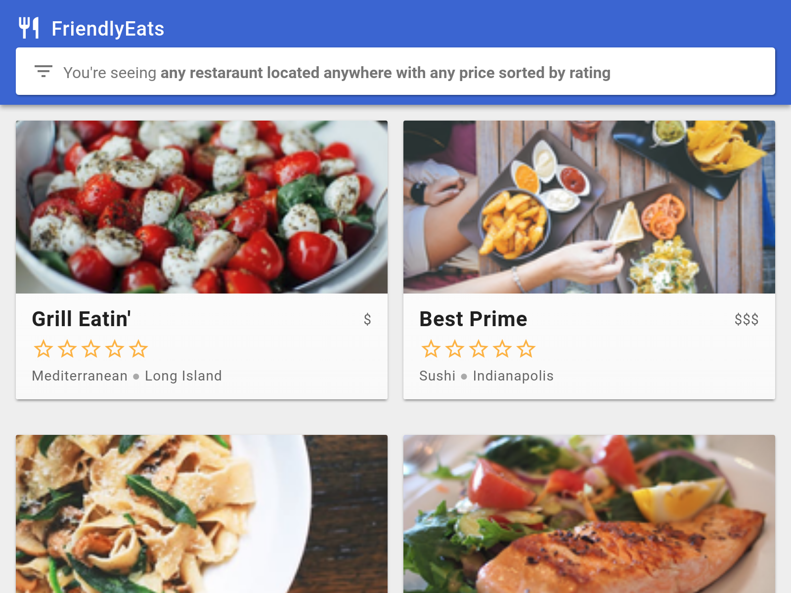

# FriendlyEats (Web)

## Introduction

FriendlyEats is a restaurant recommendation app built on Cloud Firestore.
For more information about Firestore visit [the docs][firestore-docs].

You can run it and test it in practice



## Setup
to run use the command :

```
npm i
```

```
firebase serve
```

## License

© Google, 2018. Licensed under an [Apache-2](./LICENSE) license.

## Build Status

[](https://travis-ci.org/firebase/friendlyeats-web)

[codelab]: https://codelabs.developers.google.com/codelabs/firestore-web
[quickstart]: https://github.com/firebase/quickstart-js/tree/master/firestore
[firestore-docs]: https://firebase.google.com/docs/firestore/

firebase emulators:start --only hosting